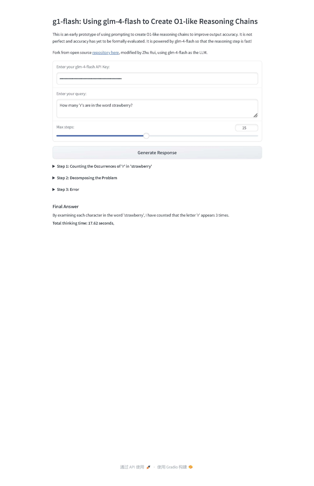

# g1-flash
g1-flash: Using glm-4-flash to Create O1-like Reasoning Chains


# g1-flash: Using glm-4-flash to Create O1-like Reasoning Chains

g1-flash is an early prototype that utilizes prompting techniques to generate O1-like reasoning chains, aiming to improve the accuracy of AI-generated outputs. Powered by the **glm-4-flash** model from ZhipuAI, this application provides fast and detailed reasoning steps to user queries through an interactive web interface built with Gradio.

This project is a fork of the open-source [g1 repository](https://github.com/bklieger-groq/g1), modified by Zhu Rui to integrate glm-4-flash as the underlying language model.

## Features

- **Step-by-Step Reasoning**: Generates detailed reasoning steps to provide comprehensive answers.
- **Fast Processing**: Leverages glm-4-flash for quick response times.
- **Interactive Interface**: User-friendly web interface built with Gradio.
- **Customizable Steps**: Allows users to set the maximum number of reasoning steps.

## Table of Contents

- [Installation](#installation)
- [Usage](#usage)
- [Example](#example)
- [License](#license)
- [Acknowledgments](#acknowledgments)

## Installation

### Prerequisites

- Python 3.6 or higher
- An API key for **glm-4-flash** from [ZhipuAI](https://www.zhipuai.cn/)

### Clone the Repository

```bash
git clone https://github.com/yourusername/g1-flash.git
cd g1-flash
```

### Install Dependencies

Install the required Python packages using pip:

```bash
pip install -r requirements.txt
```

**Dependencies include:**

- `gradio`
- `zhipuai`
- `json`

## Usage

1. **Obtain an API Key**: Sign up on [ZhipuAI](https://www.zhipuai.cn/) to get your glm-4-flash API key.

2. **Run the Application**:

   ```bash
   python app.py
   ```

3. **Access the Interface**: Open your web browser and navigate to the URL provided in the terminal (e.g., `http://127.0.0.1:7860`).

4. **Enter Your API Key**: Input your glm-4-flash API key in the designated field.

5. **Submit a Query**:

   - Enter your question or prompt in the "Enter your query" textbox.
   - Adjust the "Max steps" slider to set the desired number of reasoning steps.
   - Click on the **Generate Response** button.

6. **View the Results**: The application will display the reasoning steps and the final answer. Each step includes:

   - **Title**: A brief description of the step.
   - **Content**: Detailed reasoning for that step.
   - **Thinking Time**: Time taken to generate the step.

## Example

**Sample Query**:

```
How many 'R's are in the word strawberry?
```

**Steps Generated**:

1. **Step 1: Analyzing the Word**
   - Content: Break down the word "strawberry" to identify each letter.
   - Thinking Time: 0.5 seconds

2. **Step 2: Counting the Letter 'R'**
   - Content: Count the number of times 'R' appears in "strawberry".
   - Thinking Time: 0.4 seconds

3. **Final Answer**
   - Content: There are two 'R's in the word "strawberry".

**Total Thinking Time**: 1.2 seconds



## License

This project is licensed under the [MIT License](LICENSE).

## Acknowledgments

- **Original Author**: [bklieger-groq](https://github.com/bklieger-groq/g1)
- **Modifier**: Zhu Rui
- **Powered By**: [glm-4-flash](https://www.zhipuai.cn/) from ZhipuAI
- **Built With**: [Gradio](https://gradio.app/)

---

Feel free to contribute to the project by submitting issues or pull requests. For major changes, please open an issue first to discuss what you would like to change.

For any questions or feedback, please issue.
